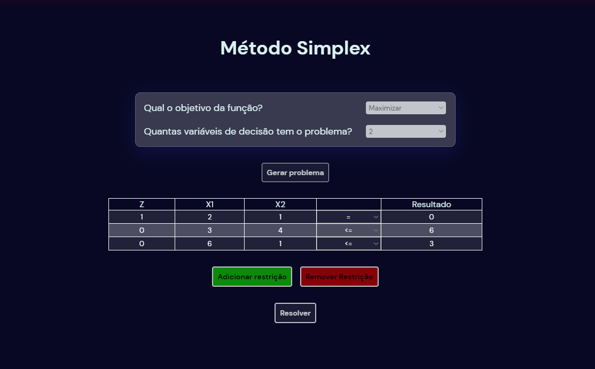
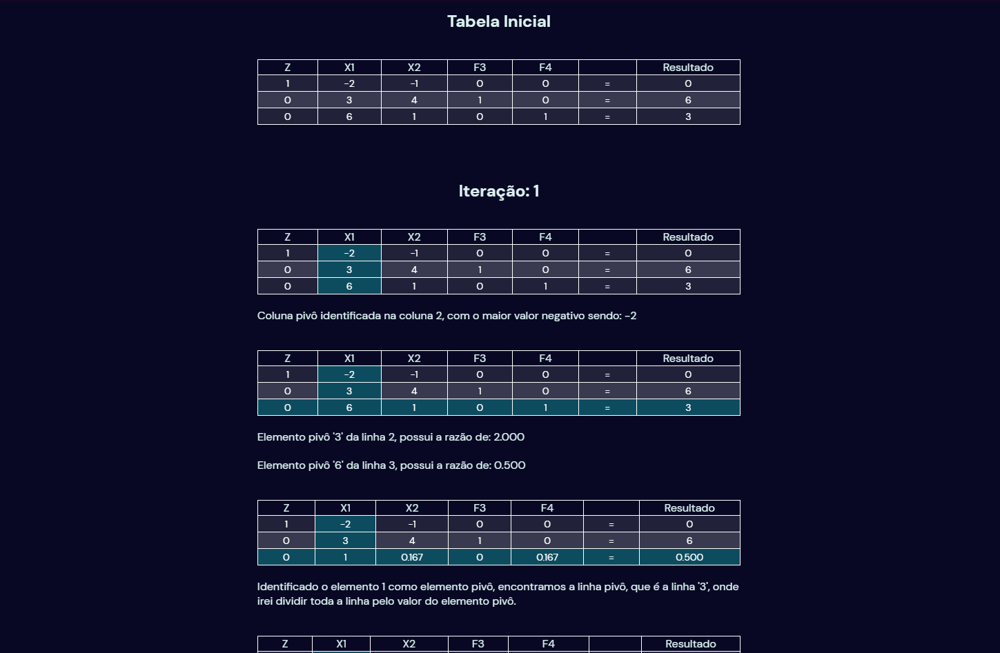
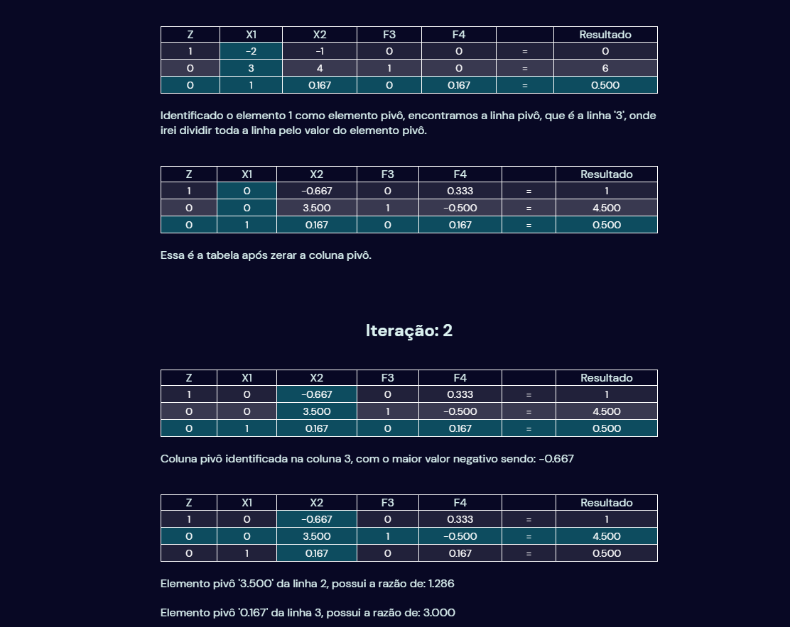
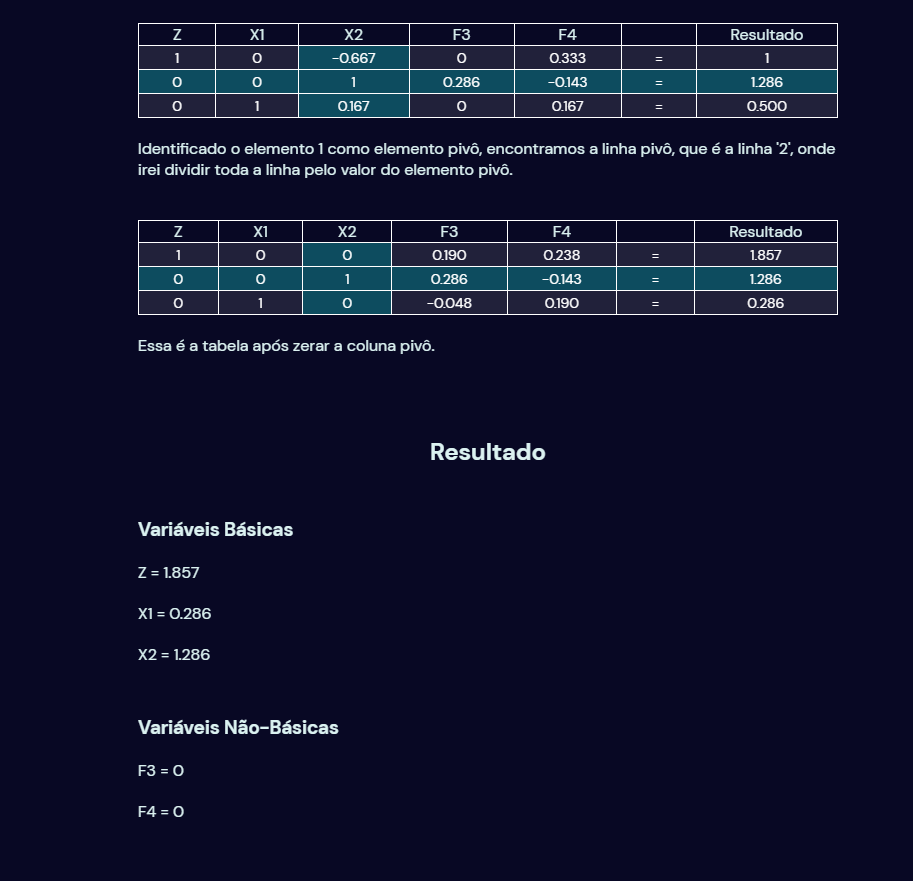

<h1 align="center">Método Simplex</h1>

[Projeto](#projeto) &nbsp;&nbsp;&nbsp;|&nbsp;&nbsp;&nbsp; [Tecnologias](#tecnologias)
&nbsp;&nbsp;&nbsp;|&nbsp;&nbsp;&nbsp; [Layout](#layout) &nbsp;&nbsp;&nbsp;|&nbsp;&nbsp;&nbsp;
[Licença](#license)

  

 
 

## 💻 Projeto 

O método simplex é um algoritmo utilizado para resolver problemas de programação linear, que
consiste em maximizar ou minimizar uma função linear sujeita a um conjunto de restrições lineares,
funciona através da criação de um conjunto inicial de soluções viáveis para o problema, conhecido
como tabela simplex, e da aplicação de uma série de operações de pivô para melhorar a solução e
chegar à solução ótima.

A tabela simplex é formada por uma matriz de coeficientes, que representa as equações das restrições
e da função objetivo, e um vetor de termos independentes, que representa os valores das restrições.
A cada iteração do método simplex, uma variável básica é escolhida para deixar a base e uma variável
não básica é escolhida para entrar na base, de forma que a solução seja melhorada.

Existem 3 tipos de soluções, ótima, ilimitada e inviável. A minha aplicação está apta para obter
somente soluções ótimas e analisar antes de tudo se o problema pode ser resolvido com o simplex ou
não. Precisa de uma pesquisa mais aprofundada para poder implementar a lógica das soluções
ilimitadas e inviáveis, talvez um dia eu implemente essa parte.

O Simplex quando se trata de resolver problemas onde se busca maximizar é simples de resolver, onde
utilizei da própria lógica do simplex para fazer. Já o de minimização estava dando muitas falhas,
então tive que procurar outros meios de resolver esse problema, quando encontrei o Simplex
Generalizado, que é uma extensão do método simplex clássico que foi desenvolvido para lidar com
problemas de programação linear mais complexos.

 
 

## 🔖 Etapas do Simplex 

O Simplex começa com a definição do objetivo da função, quantidade de variáveis e restrições.

Caso o objetivo da função seja minimizar, multiplicamos toda a tabela por -1.

 

 

Após setar os valores, os cálculos em cima dessa matriz serão feitos, onde o primeiro passo é
encontrar a coluna pivô.

Na maximização, encontra-se ela procurando o maior elemento negativo na linha de Z, ou seja, a
primeira linha. Já na minimização, procuro o menor número absoluto dessa linha.

Após encontrar a coluna pivô, vamos em busca da linha pivô, que é identificada através da menor
razão entre o resultado de cada restrição e o elemento da mesma na coluna pivô, conforme a imagem.
Isso na maximização, já na minimização, eu notei um padrão em muitos testes com diferentes problemas
em que a linha pivô era onde a menor soma de todos os elementos da linha analisada, não tive tempo
de procurar saber se isso era um fato ou coincidência, mas resolveu a maioria dos problemas com
exatidão e alguns outros chegou muito próximo da solução ótima.

 

 

Depois de encontrar a coluna e a linha pivô, precisamos tornar o elemento pivô, que é o elemento que
intersecciona essa coluna e linha pivô, ser igual a 1. Para isso divide toda a linha pelo próprio
valor.

Sendo assim, podemos zerar a coluna pivô, onde novamente o mesmo cálculo é aplicado para toda a
linha.

O processo todo é muito iterativo e só para quando a linha da função objetiva (Z), náo possui mais
números negativos, em maximização. Quando é minimização, procuro ver se não há mais elementos
negativos nas respostas, outro padrão que notei e aderi ao algoritmo.

 

 

Para mostrar o resultado, é necessário que a coluna de algum elemento seja toda zerada, exceto um
elemento com valor de 1, que são as variáveis básicas. As não-básicas podem ser zeradas e não
utilizadas para chegar na solução ótima.

 

 
 

## 🚀 Tecnologias 

- HTML
- CSS
- JavaScript

 
 

## 🔒 Licença

Esse projeto está sob a licença MIT.

